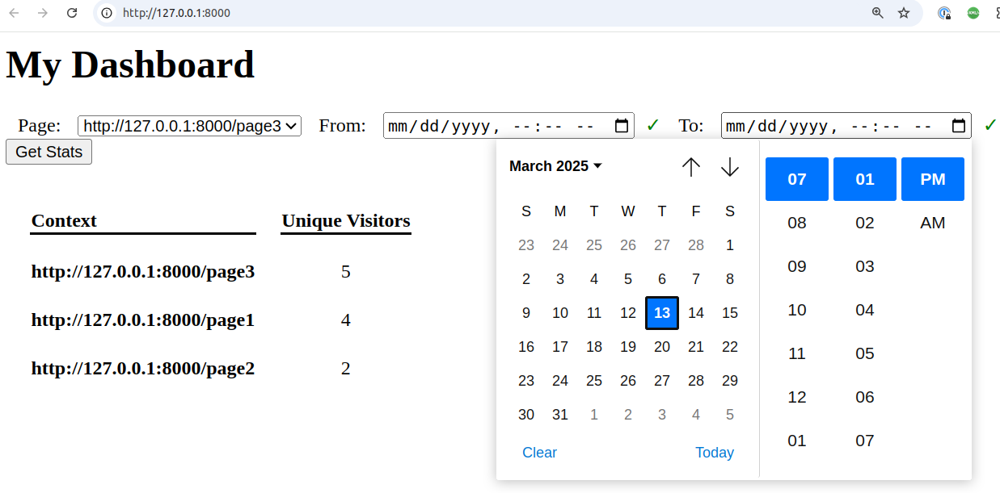

# Simple website traffic tracker (PoC)

## Project requirements (installed locally)
- PHP 8.2.x
- Composer 2.2.x
- MySQL 8.0.x

## Project Setup

### Install database `website` and table `visits` from `db_schema.sql` into your MySQL local server

### Set your MySQL `website` database username and password in the `.env` file
```
DB_USERNAME=
DB_PASSWORD=
```

### Install code dependencies
```sh
composer install
```

### Start the built-in PHP Web server
```sh
 php -S 127.0.0.1:8000 server.php
```

### Run the Project tests
```sh
composer tests
```

### Open the Dashboard [page](http://127.0.0.1:8000/)

## Project Description
This is a simple website traffic tracker that tracks unique visits to a website pages.
It has 3 main components:
1. An `Javascript tracker` widget that clients will add to their websites (`public/widget/website_visit_tracker.js`)
2. Database storing the visits data (`website.visits` table)
3. Simple user interface that displays the number of unique visits per page, for a given time period (dashboard [page](http://127.0.0.1:8000/))

## How it works

### The Dashboard page
The project deals with loading a local website pages through the built-in PHP web server.   
After starting the web server, open the Dashboard page located at http://127.0.0.1:8000/   
The Dashboard page contains the filters and results area.
Is possible to filter using `Page` dropdown and `From/To` date pickers.
The filtered results will be displayed, after clicking the `Get Stats` button, in the datatable below within the columns `Context` and `Unique Visitors`.   

### The Website pages
Separately in tabs, open as many website page urls using the format `http://127.0.0.1:8000/<path>` like  http://127.0.0.1:8000/test or http://127.0.0.1:8000/test/in/test   
The `<path>` parameter can be any combination of alphanumeric chars as long you keep it as a valid website URL.   
Now, inside each tab, re-fresh the website page many times to generate unique visitors, only happening `each 10 seconds`.   
The unique visitors data is stored in the database `website.visits` table by the `Javascript tracker` widget which is added automatically in all the website pages content.   
Return to the Dashboard page tab where you can visualize and filter the `Unique Vistors` count per page or all website pages.

### Dashboard Screenshot
